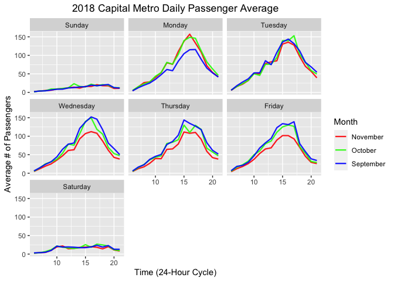
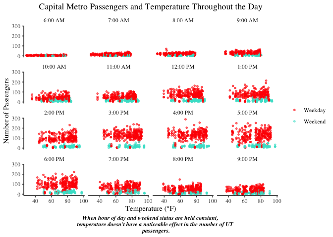
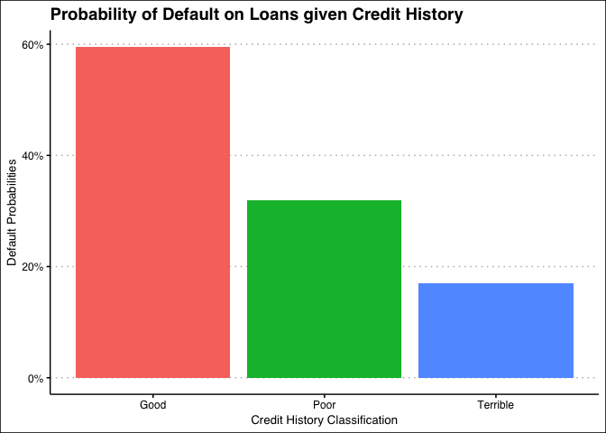
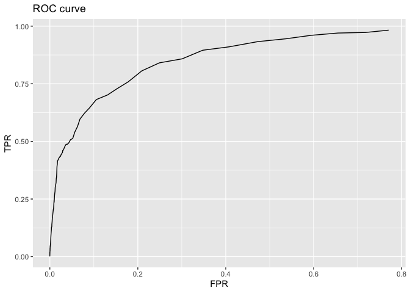
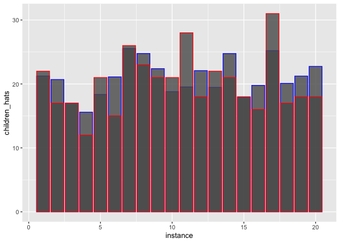

Question 1
----------

### Observing Metro Passengers throughout various months and days

On weekdays, the peak number of average passengers board the metro
around 3 PM to 5:30 PM. During the weekends, the magnitude of passengers
is nowhere near that of weekdays, but traffic incrementally increases
over time throughout the weekend. On average, Monday’s were lower in
September most likely due to holidays such as Labor Day. We could
observe lower overall average passengers in November on Wednesdays,
Thursdays, and Fridays,because of Thanksgiving holiday.In 2022 and
onward, I anticipate average November passengers to be lower throughout
the whole week as Thanksgiving break has been extended to a full week.

### Metro Passengers vs. Temperature

Question 2
----------

    ##   rmse_med rmse_large 
    ##   66267.41   63020.64

We can see that for the average RMSE the new Model named lm\_large
continuously beats out the lm\_medium. We can then assume that the new
model is a better and more efficient estimator for pricing of houses.
The inclusion of interaction variables in the lm\_large model were
important in reducing the RMSE. The interaction between “Land Value” and
“Lot Size” could be an important variable, as the size of the lot
increases so will the value of the land. As well we included an
interaction for “Heating” and “Central Air” as they most likely are
included packaged in most houses.

    ##   [1] 86085.65 79076.47 76509.71 76677.36 75136.16 75108.89 74822.76 75460.09
    ##   [9] 75060.41 75820.70 75621.14 75574.05 75343.36 75615.38 76230.75 75964.73
    ##  [17] 75968.77 75968.42 76102.12 76200.65 76369.36 76545.23 76858.21 76806.55
    ##  [25] 76888.67 76777.85 76853.58 77034.45 77310.59 77494.07 77376.93 77363.73
    ##  [33] 77639.93 77785.91 77945.97 78132.64 78078.33 78142.38 78290.80 78455.24
    ##  [41] 78381.15 78620.57 78702.29 78708.29 78835.40 78871.74 78907.08 78789.70
    ##  [49] 79043.38 79064.81 79116.22 79180.58 79331.71 79270.35 79218.94 79221.83
    ##  [57] 79348.99 79393.44 79487.89 79422.96 79499.16 79544.34 79581.95 79640.37
    ##  [65] 79730.03 79869.02 79924.49 79970.86 79927.55 79882.66 79842.65 79826.98
    ##  [73] 79816.89 79881.68 79842.21 79700.94 79764.65 79819.15 79780.43 79841.55
    ##  [81] 79841.52 79787.32 79788.25 79892.64 79922.97 79898.01 79879.94 79875.80
    ##  [89] 79870.66 79885.68 79895.62 79899.49 80019.70 80032.70 80016.01 80094.16
    ##  [97] 80083.34 80125.56 80112.26 80102.73

After running the RMSE for different levels of K, we found that
consistently one of the lowest estimators for Price given our KNN
estimate is K=10. We will use K=10 as our value in the bakeoff against
the the linear model.

    ##   rmse_knn rmse_large 
    ##   67204.33   61962.82

We see that iterated over 100 trials the lm\_large has a consistently
lower RMSE compared to the KNN model. This lets us know that for the
pricing of these of houses our lm\_large is a better estimator than our
scaled KNN estimator.

Question 3
----------

### Default Probability Bar Plot

### GLM Output (Transformed and Exponentiated Values):

    ##   X.Intercept. duration   amount installment       age historypoor
    ## 1    0.4928621  1.02558 1.000096    1.248074 0.9800183   0.3303554
    ##   historyterrible purposeedu purposegoods.repair purposenewcar purposeusedcar
    ## 1       0.1518784   2.064297            1.110604      2.350096      0.4511632
    ##   foreigngerman
    ## 1     0.2823309

The “odds” table contains the transformed, exponentiated betas produced
by the logistic regression, which can be interpreted as multipliers to
the odds ratio. For example, we find that having “poor” credit history
compared to “good” multiplies the odds of default by 0.33–the odds of
default are reduced by two-thirds. This does not seem right according to
the intuition that someone with poor credit should have HIGHER odds of
default. This foreshadows the problem with the retrospective sampling in
this instance. The bank including loans that were defaulted is creating
an inherent bias in the sampling of data (i.e. - random sampling seems
to not have been the form of data collection). Therefore, the data set
is not appropriate for building a predictive model of defaults.
Recommendations for better sampling is to incorporate simple random
sampling or clustering methods to prevent bias and any endogeneity
issues.

Question 4
----------

Model building: In order to predict whether or not a child will be
present for a given hotel booking given other characteristics of that
reservation, we build three linear probability models with a variable
probability threshold that predicts 1 (child present) or 0 (child not
present) if the predicted probabilities exceed that threshold. We
construct a confusion matrix that calculates the TPR (true positive
rate) for each model as a singular (but not comprehensive) measure of
out-of-sample performance.

The first model, “baseline1” incorporates market\_segment, adults,
customer\_type, and is\_repeated\_guest variables as features. We use a
baseline probability threshold of p = 0.15:

    ## [1] 0.01728723

We get a TPR of 0.022, which is abysmal, but this figure improves with
our next model “baseline2”, which incorporates all the variables except
for arrival\_date:

    ## [1] 0.5890957

With this model, holding everything else constant and only changing the
feature set we incorporate, we get a TPR of 0.582, which is decidedly
better than the first model.

The third model is the one we built ourselves by starting with
“baseline2” and adding the interaction between average\_daily\_rate and
adults:

    ## [1] 0.5904255

This model gives us a TPR of 0.586, which is an improvement of about
.004 compared to the second model. Technically, this is better model
performance according to the singular metric of TPR at the given
threshold of p = 0.15. This is not necessarily a good measure to use by
itself, as the overall accuracy rate of this model is slightly lower
than the first. But for the purposes of this question we’ll consider
this a step up from the previous model.

Model validation: Now we’ll load in hotels\_val.csv, which is data that
this model has not seen previously. We’ll use the model “baseline3,” and
produce a ROC curve that plots the TPR and FPR for every value of the
probabilty threshold.

Peak classification performance happens at the furthest northwest corner
of this curve, which occurs in the neighborhood of threshold values
between p = 0.10 and p = 0.15 (so our starting baseline of p = 0.15 was
a pretty good guess!)

    ## [1] 3.744783

This plot shows the predicted number of children per fold in blue, and
the true number of children per fold in red. Depending on the random
split, the RMSE is somewhere between 3 and 4, which means our estimate
is pretty accurate.
